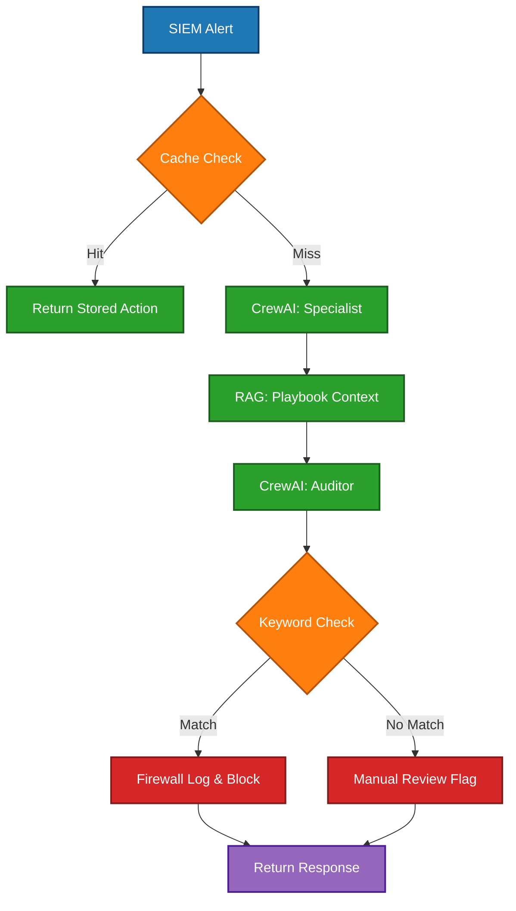

## Security Workflow Diagram

### Project Milestone: Phase 10 - Resilience Engineering
On April 19, 2026, the Agentic SOC was subjected to high-frequency concurrency testing to simulate an active brute-force scenario.

#### **Technical Deep Dive**
* **Hydra Burst Simulation:** Processed 10 concurrent multi-agent triage requests (20+ LLM instances) on NVIDIA DGX hardware.
* **Latency Optimization:** Implemented an asynchronous caching layer that reduced processing time for recurring threats from ~30s to <10ms.
* **Supply Chain Hardening:** Successfully navigated the March 2026 LiteLLM/Pydantic dependency conflict, ensuring environment integrity during the TeamPCP security incident.

#### **Core Tech Stack**
* **Inference:** Llama 3.2 via Ollama
* **Orchestration:** CrewAI (Analyst & Auditor Agents)
* **Framework:** FastAPI / Async Python 3.12

[View Technical Repository](https://github.com/bishwast/Agentic-SOC)
